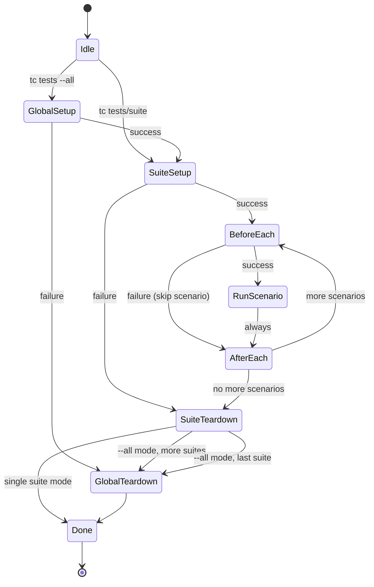

# Data Model: Lifecycle Hooks and Stateful Test Runners

**Feature**: 007-description-add-lifecycle
**Date**: 2025-10-16
**Phase**: Phase 1 - Design

## Overview

This document defines the data structures, state machines, and environment models for lifecycle hooks and stateful test runners in tc framework.

---

## Hook Execution Model

### Hook Types

| Hook Name | Scope | Frequency | Required | Failure Behavior |
|-----------|-------|-----------|----------|------------------|
| `global_setup.sh` | All suites | Once per `--all` run | No | Abort all suites |
| `global_teardown.sh` | All suites | Once per `--all` run | No | Log error, continue |
| `setup.sh` | Suite | Once per suite | No | Abort suite |
| `teardown.sh` | Suite | Once per suite | No | Log error, continue |
| `before_each.sh` | Scenario | Per scenario | No | Skip scenario |
| `after_each.sh` | Scenario | Per scenario | No | Log warning, continue |

### Hook File Structure

**Per-suite hooks** (in suite directory):
```
tests/my-suite/
├── setup.sh              # Optional - runs once before scenarios
├── before_each.sh        # Optional - runs before each scenario
├── after_each.sh         # Optional - runs after each scenario
├── teardown.sh           # Optional - runs once after scenarios
├── run                   # Required - test runner
├── .tc-env               # Generated by hooks - state file
└── data/                 # Test scenarios
    └── scenario-1/
        ├── input.json
        └── expected.json
```

**Global hooks** (in test root):
```
tests/
├── .tc/
│   └── hooks/
│       ├── global_setup.sh      # Optional - runs once before all suites
│       ├── global_teardown.sh   # Optional - runs once after all suites
│       └── .tc-env              # Generated - global state file
└── my-suite/
    └── ...
```

### Hook Metadata

Hooks are discovered by file presence (no metadata file required).

**Validation**:
```bash
is_valid_hook() {
    local hook_file="$1"

    # Must exist
    [ -f "$hook_file" ] || return 1

    # Must be executable
    [ -x "$hook_file" ] || return 1

    # Must be a regular file (not symlink or directory)
    [ ! -L "$hook_file" ] || return 1

    return 0
}
```

---

## State Machine: Suite Execution with Hooks

### States

```
IDLE → GLOBAL_SETUP → SUITE_SETUP → SCENARIO_LOOP → SUITE_TEARDOWN → GLOBAL_TEARDOWN → DONE

Where SCENARIO_LOOP is:
  BEFORE_EACH → RUN_SCENARIO → AFTER_EACH → (next scenario or exit loop)
```

### State Transitions



### State Transition Table

| Current State | Event | Next State | Side Effects |
|--------------|-------|------------|--------------|
| IDLE | `tc tests --all` | GLOBAL_SETUP | Load global hooks |
| IDLE | `tc tests/suite` | SUITE_SETUP | Load suite hooks |
| GLOBAL_SETUP | Success | SUITE_SETUP | Process first suite |
| GLOBAL_SETUP | Failure | GLOBAL_TEARDOWN | Abort all suites |
| SUITE_SETUP | Success | BEFORE_EACH | Process first scenario |
| SUITE_SETUP | Failure | SUITE_TEARDOWN | Abort suite, mark error |
| BEFORE_EACH | Success | RUN_SCENARIO | Execute test |
| BEFORE_EACH | Failure | AFTER_EACH | Skip scenario, mark error |
| RUN_SCENARIO | Success/Failure | AFTER_EACH | Record result |
| AFTER_EACH | More scenarios | BEFORE_EACH | Process next scenario |
| AFTER_EACH | No more scenarios | SUITE_TEARDOWN | Finish suite |
| SUITE_TEARDOWN | More suites | SUITE_SETUP | Process next suite |
| SUITE_TEARDOWN | Last suite | GLOBAL_TEARDOWN | Finish all suites |
| GLOBAL_TEARDOWN | Always | DONE | Exit |

---

## Environment Variables

### Standard Variables (Provided by tc)

#### All Hooks

| Variable | Type | Example | Description |
|----------|------|---------|-------------|
| `TC_SUITE_PATH` | Path | `/home/user/tests/my-suite` | Absolute path to suite directory |
| `TC_HOOK_TYPE` | String | `setup`, `teardown`, `before_each`, `after_each` | Current hook type |
| `TC_ROOT` | Path | `/home/user/tests` | Absolute path to test root |

#### Before/After Each Hooks Only

| Variable | Type | Example | Description |
|----------|------|---------|-------------|
| `TC_SCENARIO` | String | `create-user` | Current scenario name |
| `TC_DATA_DIR` | Path | `/home/user/tests/my-suite/data/create-user` | Absolute path to scenario data |

#### Global Hooks Only

| Variable | Type | Example | Description |
|----------|------|---------|-------------|
| `TC_GLOBAL_HOOK` | Boolean | `true` | Indicates global hook context |

### Environment Variable Schema

```bash
# Exported by tc before running hooks
export TC_SUITE_PATH="/absolute/path/to/suite"
export TC_HOOK_TYPE="setup"  # or teardown, before_each, after_each
export TC_ROOT="/absolute/path/to/test/root"

# For before_each and after_each only:
export TC_SCENARIO="scenario-name"
export TC_DATA_DIR="/absolute/path/to/suite/data/scenario-name"

# For global hooks:
export TC_GLOBAL_HOOK="true"
```

### Custom Variables (User-Defined via .tc-env)

**Format**: `.tc-env` file contains bash export statements

**Example**:
```bash
# .tc-env created by setup.sh
export PGDATABASE="test_db_12345"
export PGHOST="localhost"
export PGPORT="5432"
export PGUSER="test_user"
export MY_API_TOKEN="abc123xyz"
```

**Loading**:
```bash
# In subsequent hooks or runner
if [ -f "$TC_SUITE_PATH/.tc-env" ]; then
    source "$TC_SUITE_PATH/.tc-env"
fi
```

**Cleanup**:
```bash
# In teardown.sh
rm -f "$TC_SUITE_PATH/.tc-env"
```

---

## Runner Modes

### Stateless Mode (Default)

**Trigger**: No `setup.sh` exists in suite

**Behavior**:
- Fresh `run` process spawned per scenario
- No shared state between scenarios
- Input passed on stdin
- Output captured from stdout
- Process exits after each test

**Lifecycle**:
```
FOR EACH scenario:
  1. Spawn: ./run < data/scenario/input.json
  2. Capture: stdout → actual.json
  3. Compare: actual.json vs expected.json
  4. Kill: Process exits
```

### Stateful Mode (Opt-In)

**Trigger**: `setup.sh` exists in suite

**Behavior**:
- Single `run` process for entire suite
- Shared state (database connection, etc.)
- JSON protocol for communication
- Process stays alive across scenarios
- Graceful shutdown at end

**Lifecycle**:
```
1. setup.sh runs (establishes resources)
2. Spawn: ./run (stays alive)
3. FOR EACH scenario:
   a. before_each.sh runs (per-test setup)
   b. Send: {"command":"test","scenario":"...","input_file":"..."}
   c. Receive: {"status":"pass|fail","output":"...","duration_ms":123}
   d. after_each.sh runs (per-test cleanup)
4. Send: {"command":"shutdown"}
5. Wait: Runner exits gracefully
6. teardown.sh runs (cleanup resources)
```

---

## State File Format: .tc-env

### Purpose

Share state between hooks and runner.

### Location

- Per-suite: `$TC_SUITE_PATH/.tc-env`
- Global: `$TC_ROOT/.tc/hooks/.tc-env`

### Format

Bash source-able export statements:

```bash
# Lines starting with # are comments
# Each export must be on one line
# Values with spaces must be quoted

export VAR_NAME="value"
export ANOTHER_VAR="value with spaces"
export NUMERIC_VAR=12345
```

### Schema Validation

**Valid**:
```bash
export FOO="bar"
export BAZ=123
export MULTI="line\nvalue"  # Escaped newlines OK
```

**Invalid**:
```bash
FOO="bar"               # Missing export keyword
export FOO=bar baz      # Spaces without quotes
export FOO="unclosed    # Unclosed quote
```

### Usage Pattern

**Create in setup.sh**:
```bash
#!/usr/bin/env bash
set -e

# Initialize resources
export DB_NAME="test_db_$$"
createdb "$DB_NAME"

# Save to .tc-env for other hooks
cat > .tc-env << EOF
export DB_NAME="$DB_NAME"
export DB_HOST="localhost"
EOF
```

**Load in before_each.sh**:
```bash
#!/usr/bin/env bash
set -e

# Load state from setup.sh
source .tc-env

# Use variables
psql -d "$DB_NAME" -c "TRUNCATE users CASCADE"
```

**Load in runner**:
```ruby
#!/usr/bin/env ruby
# run - stateful runner

# Load .tc-env
env_file = File.join(__dir__, '.tc-env')
if File.exist?(env_file)
  File.readlines(env_file).each do |line|
    next if line.strip.empty? || line.start_with?('#')
    # Parse: export KEY="value"
    if line =~ /^export\s+(\w+)="?([^"]*)"?/
      ENV[$1] = $2
    end
  end
end

# Now ENV['DB_NAME'] is available
```

**Cleanup in teardown.sh**:
```bash
#!/usr/bin/env bash

# Load state
source .tc-env || true

# Cleanup resources
dropdb "$DB_NAME" 2>/dev/null || true

# Delete state file
rm -f .tc-env
```

---

## Runner Process State

### Process Lifecycle

```
SPAWNED → INITIALIZING → READY → PROCESSING → SHUTTING_DOWN → EXITED
```

### State Details

| State | Description | Duration | tc Action |
|-------|-------------|----------|-----------|
| SPAWNED | Process created | Instantaneous | Wait for ready |
| INITIALIZING | Runner loading resources | 0-5s | Monitor stderr |
| READY | Waiting for commands | Indefinite | Send test command |
| PROCESSING | Executing test | Per test timeout | Wait for response |
| SHUTTING_DOWN | Cleanup in progress | 0-5s | Wait or force kill |
| EXITED | Process terminated | N/A | Verify exit code |

### Process Tracking

**Data stored in suite directory**:

`.tc-runner-pid`:
```
12345
```

`.tc-runner-fifo`:
```
/tmp/tc-runner-fifo-12345
```

---

## Hook Execution Log

### Log Format

Hooks write structured logs to tc's logging system.

**Log Entry Schema**:
```json
{
  "timestamp": "2025-10-16T12:34:56.789Z",
  "level": "info|error|debug",
  "hook_type": "setup|teardown|before_each|after_each|global_setup|global_teardown",
  "suite_path": "/absolute/path/to/suite",
  "scenario": "scenario-name",  // Optional: only for before_each/after_each
  "duration_ms": 123,
  "exit_code": 0,
  "stderr": "captured stderr output"  // Optional: only on failure
}
```

**Example**:
```json
{"timestamp":"2025-10-16T12:34:56.789Z","level":"info","hook_type":"setup","suite_path":"/home/user/tests/db-suite","duration_ms":450,"exit_code":0}
{"timestamp":"2025-10-16T12:34:57.890Z","level":"error","hook_type":"before_each","suite_path":"/home/user/tests/db-suite","scenario":"create-user","duration_ms":23,"exit_code":1,"stderr":"psql: connection failed"}
```

---

## Hook Failure Model

### Exit Codes

| Exit Code | Meaning | Hook Action | Suite Action |
|-----------|---------|-------------|--------------|
| 0 | Success | Continue | Continue |
| 1 | General error | Fail hook | See failure behavior |
| 2+ | Specific error | Fail hook | See failure behavior |
| 124 | Timeout | Fail hook | See failure behavior |
| 127 | Command not found | Fail hook | See failure behavior |

### Failure Behavior Matrix

| Hook Type | Exit ≠ 0 | Skip Current Test? | Abort Suite? | Run Teardown? | Log Level |
|-----------|----------|-------------------|--------------|---------------|-----------|
| global_setup | Yes | N/A | Yes (all suites) | Yes (global) | ERROR |
| setup | Yes | N/A | Yes | Yes | ERROR |
| before_each | Yes | Yes | No | Yes (after_each) | ERROR |
| after_each | Yes | No | No | Continue | WARN |
| teardown | Yes | N/A | No | N/A | WARN |
| global_teardown | Yes | N/A | No | N/A | WARN |

### Error Information

**Captured on failure**:
- Exit code
- stderr output (up to 10KB)
- Duration
- Timestamp

**Reported to user**:
```
ERROR: setup.sh failed (exit code 1, 450ms)
psql: FATAL: database "test_db_12345" does not exist
```

---

## Runner Protocol State

See `contracts/runner-protocol.md` for complete protocol specification.

### Message State

```
IDLE → COMMAND_SENT → RESPONSE_PENDING → RESPONSE_RECEIVED → IDLE
```

### Message Types

| Direction | Type | State Transition |
|-----------|------|------------------|
| tc → runner | test | IDLE → COMMAND_SENT |
| runner → tc | result | RESPONSE_PENDING → RESPONSE_RECEIVED |
| tc → runner | shutdown | IDLE → COMMAND_SENT |
| runner → tc | shutdown | RESPONSE_PENDING → RESPONSE_RECEIVED |

---

## Validation Rules

### Hook File Validation

```bash
# Must be regular file
[ -f "$hook_file" ] || error "Hook must be a regular file"

# Must be executable
[ -x "$hook_file" ] || error "Hook must be executable (chmod +x)"

# Must not be symlink (security)
[ ! -L "$hook_file" ] || error "Hooks cannot be symlinks"

# Must have .sh extension
[[ "$hook_file" == *.sh ]] || error "Hooks must have .sh extension"
```

### .tc-env File Validation

```bash
# Must be regular file
[ -f ".tc-env" ] || return 0  # Missing is OK

# Must be readable
[ -r ".tc-env" ] || error ".tc-env must be readable"

# Must contain valid bash syntax
bash -n .tc-env || error ".tc-env has syntax errors"
```

### Environment Variable Validation

```bash
# Required variables for all hooks
[ -n "$TC_SUITE_PATH" ] || error "TC_SUITE_PATH not set"
[ -n "$TC_HOOK_TYPE" ] || error "TC_HOOK_TYPE not set"
[ -n "$TC_ROOT" ] || error "TC_ROOT not set"

# Required for before_each/after_each only
if [[ "$TC_HOOK_TYPE" == "before_each" ]] || [[ "$TC_HOOK_TYPE" == "after_each" ]]; then
    [ -n "$TC_SCENARIO" ] || error "TC_SCENARIO not set"
    [ -n "$TC_DATA_DIR" ] || error "TC_DATA_DIR not set"
fi
```

---

## Performance Model

### Hook Execution Overhead

**Target**: < 10ms per hook execution

**Measurement Points**:
- Hook discovery: Time to check file existence and permissions
- Hook invocation: Time to spawn process and wait for exit
- Hook total: discovery + invocation + execution time

**Example Timing**:
```
Hook Discovery: 1ms (file stat)
Hook Invocation: 2ms (process spawn)
Hook Execution: User-defined (setup.sh may take seconds)
Total Overhead: 3ms + user time
```

### Stateful Runner Overhead

**Target**: < 5ms per test vs stateless mode

**Measurement Points**:
- Runner startup: One-time cost (amortized across tests)
- Message serialization: JSON encoding time
- Message transmission: Write to stdin time
- Response wait: Read from stdout time
- Message deserialization: JSON parsing time

**Example Timing**:
```
Stateless Mode (per test):
  - Process spawn: 20ms
  - Test execution: 100ms
  - Total: 120ms

Stateful Mode (per test):
  - Message send: 1ms
  - Test execution: 100ms
  - Message receive: 1ms
  - Total: 102ms

Savings: 18ms per test (15% faster)

With 10 tests:
  - Stateless: 1200ms
  - Stateful: 50ms (startup) + 1020ms (tests) = 1070ms
  - Savings: 130ms (11% faster)
```

---

## Summary

This data model defines:
- ✅ Hook types and execution order
- ✅ State machine for suite execution
- ✅ Environment variable schema
- ✅ .tc-env file format
- ✅ Runner process lifecycle
- ✅ Hook failure behavior
- ✅ Validation rules
- ✅ Performance model

**Next**: See `contracts/runner-protocol.md` for stateful runner protocol specification.
